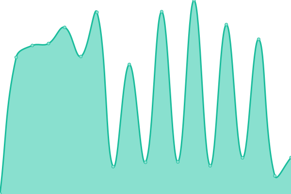
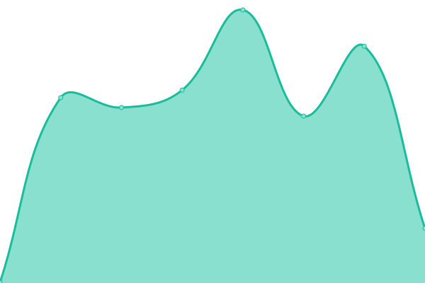

# [📈 Live Status](https://Cantsn.github.io/stokta-upptime): <!--live status--> **🟥 Complete outage**

This repository contains the open-source uptime monitor and status page for [Can Tosun](https://Cantsn.github.io/stokta-upptime), powered by [Upptime](https://github.com/upptime/upptime).

With [Upptime](https://upptime.js.org), you can get your own unlimited and free uptime monitor and status page, powered entirely by a GitHub repository. We use [Issues](https://github.com/Cantsn/stokta-upptime/issues) as incident reports, [Actions](https://github.com/Cantsn/stokta-upptime/actions) as uptime monitors, and [Pages](https://Cantsn.github.io/stokta-upptime) for the status page.

<!--start: status pages-->
<!-- This summary is generated by Upptime (https://github.com/upptime/upptime) -->
<!-- Do not edit this manually, your changes will be overwritten -->
<!-- prettier-ignore -->
| URL | Status | History | Response Time | Uptime |
| --- | ------ | ------- | ------------- | ------ |
|  [Stokta Website](https://www.stokta.app) | 🟥 Down | [stokta-website.yml](https://github.com/Cantsn/stokta-upptime/commits/HEAD/history/stokta-website.yml) | 

 532ms
     
 | 

<a href="https://Cantsn.github.io/stokta-upptime/history/stokta-website">97.17%</a>
    

|  [Stokta API](https://api.stokta.app/api/health) | 🟥 Down | [stokta-api.yml](https://github.com/Cantsn/stokta-upptime/commits/HEAD/history/stokta-api.yml) | 

 429ms
     
 | 

<a href="https://Cantsn.github.io/stokta-upptime/history/stokta-api">0.00%</a>
    

<!--end: status pages-->

[**Visit our status website →**](https://Cantsn.github.io/stokta-upptime)

## 📄 License

- Powered by: [Upptime](https://github.com/upptime/upptime)
- Code: [MIT](./LICENSE) © [Anand Chowdhary](https://anandchowdhary.com), supported by [Pabio](https://pabio.com)
- Data in the `./history` directory: [Open Database License](https://opendatacommons.org/licenses/odbl/1-0/)
